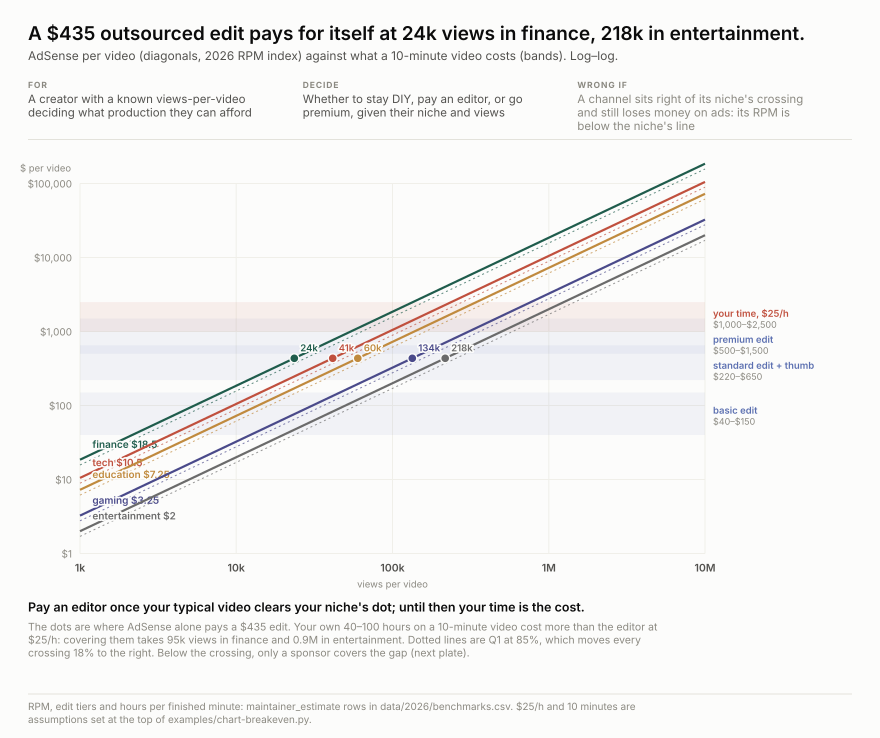
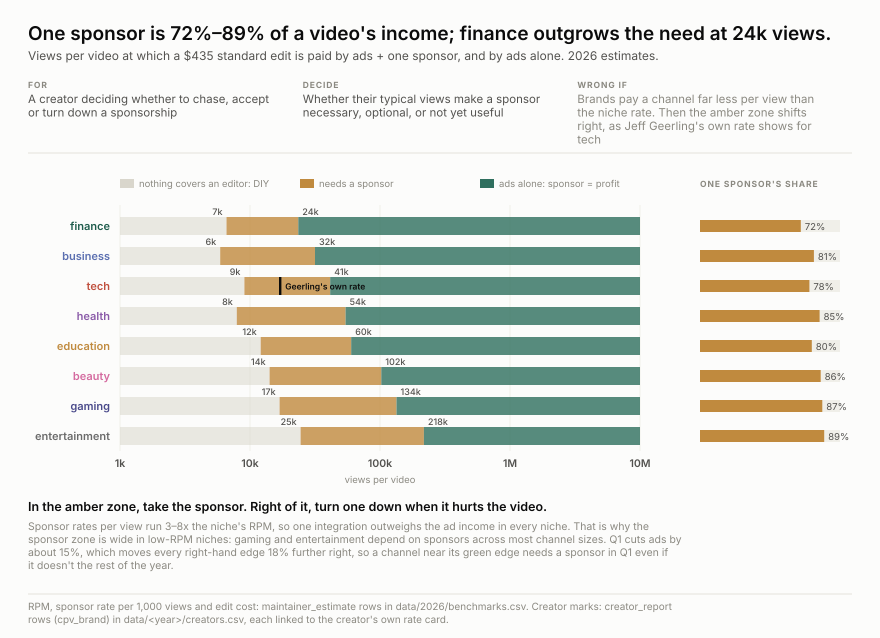
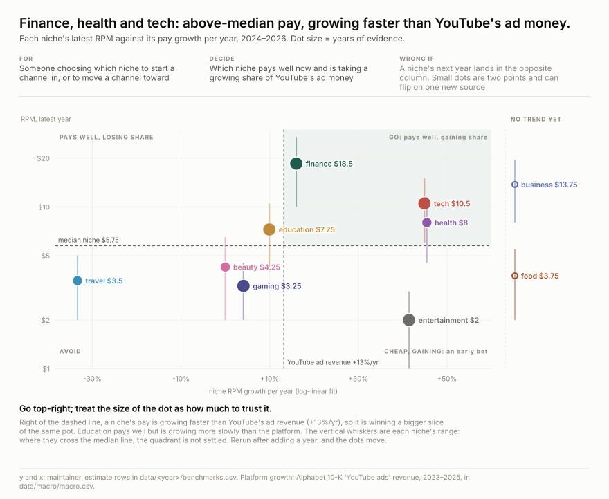
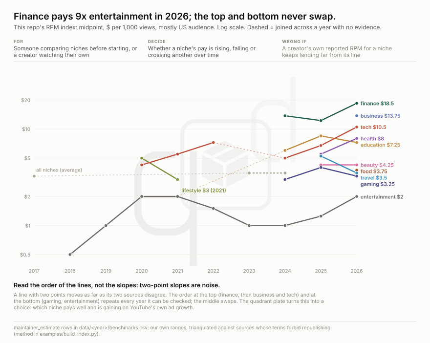
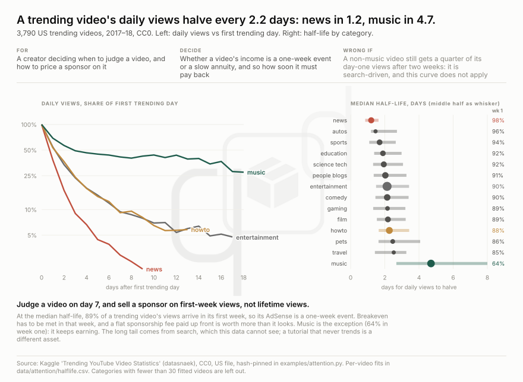

<h1 align="center">youtube-cpm</h1>

<p align="center">
  <strong>What YouTube pays per 1,000 views, by niche and by year: one row per claim, each with its source</strong>
</p>

<div align="center">

  <a href="https://github.com/q3dresearch/youtube-cpm/commits"></a>
  <a href="https://github.com/q3dresearch/youtube-cpm/blob/main/LICENSE-DATA"></a>
  <a href="https://github.com/q3dresearch/youtube-cpm"></a>

</div>

<p align="center"><sub><a href="#what-the-numbers-say">charts</a> · <a href="#research-questions">research questions</a> · <a href="#the-numbers">the numbers</a> · <a href="#where-the-numbers-come-from">sources &amp; method</a> · <a href="#add-a-data-point">add a data point</a></sub></p>

## What the numbers say



**Breakeven is set by the niche, not the channel size.** On AdSense alone, a standard
outsourced edit (`$220–650`) pays for itself at 24k views a video in finance and 218k in
entertainment. The creator's own time costs more than the editor: a 10-minute video takes
40–100 hours, and at `$25` an hour that is `$1,000–2,500.` Covering it takes 95k views a video
in finance and 0.9M in entertainment. Q1 moves every crossing 18% to the right.



**When you need sponsorships, and when you don't.** A sponsored integration pays 3–8x the
niche's RPM per view, so one sponsor is 72–89% of a video's income in every niche. Below the
amber zone nothing pays for an editor. Inside it, take the sponsor. Past the green edge, ads
alone cover the video, and a sponsor that hurts it can be turned down. Gaming and
entertainment need sponsors from 17–25k views up to 134–218k. Finance needs them only
between 7k and 24k.



**Which niche to go into: top-right.** Finance, health and tech pay above the median niche,
and their pay has grown faster than YouTube's own ad revenue (+13% a year, 2023–2025), so
they are taking a bigger share of the same pot. Education pays well but grows more slowly
than the platform. Business and food have only one year of evidence, so they have no trend
yet. Most dots rest on two or three years of data: treat them as leads.



**Read the order, not the slopes.** Finance, business and tech stay at the top in every year
they can be measured, and gaming and entertainment stay at the bottom. The niches in between
swap places from year to year. A creator's own numbers can still sit more than 10x from their
niche's line, for reasons unrelated to the niche: audience country, kids-classified views,
video length.



**Judge a video on day 7.** Across 3,790 US trending videos (a CC0 dataset), daily views
halve every 2.2 days at the median, so about 89% of a trending video's views, and its
AdSense, arrive in the first week. Its breakeven has to be met in that week, and a sponsor's
flat fee paid up front is worth more than it looks. Music is the exception, with a 4.7-day
half-life. The long tail comes from search, which this dataset cannot see: a tutorial that
never trends is a different kind of asset.


**Budget Q1 at about 85% of Q4.** Alphabet's own filings show YouTube's Q1 ad revenue below
the Q4 before it in all eight transitions from 2018 to 2025. The size of the drop does not
depend on whether the market was growing 49% or shrinking.


**The ad pot is being split across far more views.** From 2023 to 2025, YouTube's own
figures show Shorts daily views growing from 50 billion to 200 billion, while YouTube ad
revenue grew from `$31.5B` to `$40.4B`. Long-form and Shorts are paid from the same pot, so treat
Shorts as a funnel into long-form, not as income.

## Research questions

Each chart above answers one question a creator has to decide. The ones marked **open** have no
data we are allowed to publish yet.

| # | question | answer so far | evidence |
| --- | --- | --- | --- |
| Q1 | How many views does a video need to pay for itself? | `24k` a video in finance to `218k` in entertainment, for a `$435` outsourced edit on ads alone. The creator's own time costs about 4x that | [breakeven](examples/charts/breakeven.svg) |
| Q2 | When do I need sponsorships, and when don't I? | Needed between the two crossings, e.g. `7k`–`24k` views in finance and `25k`–`218k` in entertainment. One sponsor is 72–89% of a video's income | [sponsors](examples/charts/sponsors.svg) |
| Q3 | Which niche should I go into? | Finance, health and tech: above-median pay, growing faster than YouTube's ad revenue | [quadrant](examples/charts/niche-quadrant.svg) |
| Q4 | Does the niche ranking hold over time? | At the ends, yes (finance on top, entertainment at the bottom). In the middle, niches swap places from year to year | [lines](examples/charts/niche-lines.svg) |
| Q5 | How long does a video keep earning? | Trending videos: daily views halve every 2.2 days, so about 89% of views arrive in week one. Music takes 4.7 days | [attention](examples/charts/attention.svg) |
| Q6 | When in the year does income drop? | Every Q1, by 12–20% against Q4, for 8 years running, whether the market grew or shrank | [seasonality](examples/charts/seasonality.svg) |
| Q7 | Is competition diluting pay? | Shorts daily views grew 4x in 2023–25 while the ad money grew 28%, and both are paid from the same pot | [competition](examples/charts/competition.svg) |
| Q8 | How long does a *search-driven* evergreen video keep earning? | **open.** The only open view-decay data covers trending videos | needs creators' own view curves |
| Q9 | How much does audience country move RPM? | **open.** One disclosure: CPM of `$4.08` for US views against `$1.16` for India on the same video | [data/2020/creators.csv](data/2020/creators.csv) |
| Q10 | Are sponsor rates rising or falling over the years? | **open.** Sponsor rates are estimated for 2026 only | needs dated rate cards |
| Q11 | Does Shorts ever pay like long-form? | So far, no. The one published split: `$0.06` per 1,000 Shorts views against `$0.52` for the same channel's long-form in 2025, about 9x less | [data/2025/creators.csv](data/2025/creators.csv) |
| Q12 | What does a creator earn per **watch hour**, the denominator views can't inflate? | **open.** Studio shows it, but almost no creator publishes it | send a Studio screenshot with revenue and watch hours |


## The numbers

**This is a fact table, not the truth.** It records who said what about YouTube pay, and
when. It is updated by hand whenever someone publishes a new number worth keeping, usually a
creator posting their own YouTube Studio screenshot. Nothing here is scraped on a schedule.

<!-- tables:start -->
### RPM by niche, 2026

What a creator keeps per 1,000 views, mostly US audience. This is our own estimate; see [how it is made](#where-the-numbers-come-from).

| niche | RPM | evidence | creators' own reports, all years |
| --- | ---: | --- | ---: |
| **finance** | **`$10` – `$27`** | 2 voters, same year | — |
| **business** | **`$8` – `$19.50`** | 2 voters, same year | 1 |
| **tech** | **`$6` – `$15`** | 2 voters, same year | 2 |
| **health** | **`$4.50` – `$11.50`** | 2 voters, same year | — |
| **education** | **`$4` – `$10.50`** | 2 voters, same year | 1 |
| **beauty** | **`$2` – `$6.50`** | 2 voters, pooled 2025-2026 | — |
| **food** | **`$2` – `$5.50`** | 2 voters, same year | — |
| **travel** | **`$2` – `$5`** | 3 voters, pooled 2025-2026 | — |
| **gaming** | **`$2` – `$4.50`** | 2 voters, same year | — |
| **entertainment** | **`$1` – `$3`** | 2 voters, same year | 8 |

### What a video needs, 2026

Views per video at which a **`$435` standard edit + thumbnail** pays for itself. Sponsor rate is dollars per 1,000 views for one 60–90 s integration.

| niche | RPM | sponsor rate | pays with ads + a sponsor | pays with ads alone | one sponsor's share of income |
| --- | ---: | ---: | ---: | ---: | ---: |
| finance | `$18.50` | `$35` – `$60` | 7k views | 24k views | 72% |
| business | `$13.75` | `$40` – `$80` | 6k views | 32k views | 81% |
| tech | `$10.50` | `$27.50` – `$47.50` | 9k views | 41k views | 78% |
| health | `$8` | `$29` – `$65` | 8k views | 54k views | 85% |
| education | `$7.25` | `$20` – `$37.50` | 12k views | 60k views | 80% |
| beauty | `$4.25` | `$18` – `$35` | 14k views | 102k views | 86% |
| gaming | `$3.25` | `$15` – `$30` | 17k views | 134k views | 87% |
| entertainment | `$2` | `$11.50` – `$20` | 25k views | 218k views | 89% |

### The same index, every year

Midpoint of the range, dollars per 1,000 views. **—** means there was no evidence we could use that year, not a low rate.

| niche | 2017 | 2018 | 2019 | 2020 | 2021 | 2022 | 2023 | 2024 | 2025 | 2026 |
| --- | ---: | ---: | ---: | ---: | ---: | ---: | ---: | ---: | ---: | ---: |
| finance | — | — | — | — | — | — | — | `$13.75` | `$12.25` | `$18.50` |
| business | — | — | — | — | — | — | — | — | — | `$13.75` |
| tech | — | — | — | `$4.25` | `$5.50` | `$7.25` | — | `$5` | `$6.75` | `$10.50` |
| health | — | — | — | — | — | — | — | — | `$5.50` | `$8` |
| education | — | — | — | `$2` | `$2` | — | — | `$6` | `$8.50` | `$7.25` |
| beauty | — | — | — | — | — | — | — | — | `$4.25` | `$4.25` |
| food | — | — | — | — | — | — | — | — | — | `$3.75` |
| travel | — | — | — | — | — | — | — | — | `$5.25` | `$3.50` |
| gaming | — | — | — | — | — | — | — | `$3` | `$4` | `$3.25` |
| entertainment | — | `$0.50` | `$1` | `$2` | `$2` | `$1.50` | `$1` | `$1` | `$1.25` | `$2` |
| all | `$3.25` | — | — | — | — | — | `$3.50` | `$3.50` | — | — |
| lifestyle | — | — | — | `$5` | `$3` | — | — | — | — | — |

### The platform, from YouTube and Alphabet only

| year | YouTube ad revenue | Q1 vs the Q4 before | Shorts daily views | partner channels |
| ---: | ---: | ---: | ---: | ---: |
| 2017 | `$8.2B` |  |  |  |
| 2018 | `$11.2B` |  |  |  |
| 2019 | `$15.1B` | -16% |  |  |
| 2020 | `$19.8B` | -14% |  |  |
| 2021 | `$28.8B` | -13% |  | 2M+ |
| 2022 | `$29.2B` | -20% |  |  |
| 2023 | `$31.5B` | -16% | 50B+ |  |
| 2024 | `$36.1B` | -12% | 70B+ | 3M+ |
| 2025 | `$40.4B` | -15% | 200B+ |  |
| 2026 | — | -13% | 200B+ | 3M+ |

### Creators' own disclosures

48 rows from 15 creators, each linked to the creator's own post. Below is each creator's latest RPM; every row (CPM, CTR, Shorts, earlier years) is in `data/<year>/creators.csv`.

| year | creator | niche | metric | value | period | source |
| ---: | --- | --- | --- | ---: | --- | --- |
| 2025 | Brick Experiment Channel | entertainment | rpm | `$0.52` | 2025 calendar year (long-form) | [link](https://brickexperimentchannel.wordpress.com/2026/01/02/year-2025-in-review/) |
| 2023 | Shelia Huggins | legal | rpm | `$1.26` | first month after monetization (c. 2023-01) | [link](https://medium.com/over-legal/how-i-quadrupled-my-youtube-channel-rpm-in-1-month-571094d1e9bd) |
| 2023 | hahamrfunnyguy (HN) | diy | rpm | `$3.52` | channel RPM as of 2023-01 | [link](https://news.ycombinator.com/item?id=34233224) |
| 2022 | Rahul Pandey | tech | rpm | `$3.60` | 2022 calendar year | [link](https://www.indiehackers.com/post/i-made-9k-from-my-youtube-channel-in-2022-and-its-powering-my-company-904abffdbe) |
| 2021 | Linguamarina (Marina Mogilko) | education | rpm | `$2` – `$2.50` | monthly (c. early 2021) | [link](https://marinamogilko.substack.com/p/how-to-make-500k-a-month-on-youtube) |
| 2020 | Shelby Church | lifestyle | rpm | `$0.33` | lifetime of one video to 2020-04 | [link](https://onezero.medium.com/this-is-how-much-youtube-paid-me-for-my-1-000-000-viewed-video-1453cad73847) |
| 2019 | Roberto Blake | business | rpm | `$7.27` | 2019 full year | [link](https://robertoblake.com/youtube-income-reports-for-jan-nov-2019/) |

<!-- tables:end -->

## Where the numbers come from

**A value appears here only if we are allowed to publish it.** Most RPM-by-niche tables online
sit behind terms that forbid redistribution, so this repository never names them or copies
their values. Every row has a `basis`:

| `basis` | what it is | cited to |
| --- | --- | --- |
| `maintainer_estimate` | **our own index.** A range per niche and year, set after reading sources we may not republish. Trust us or don't. | this repo; `locator` says how many sources it was checked against |
| `creator_report` | a creator showing their own YouTube Studio numbers in public | the creator's own post or video, never an article about it |
| `open_source` | a dataset whose licence allows redistribution | that dataset, under its licence |
| `platform_report` | YouTube's or Alphabet's own statements and filings | the filing or official post (`data/macro/`) |

**How the index is made:** [`examples/build_index.py`](examples/build_index.py) builds it
from the private sources:

1. It needs at least two independent voters for a niche and year.
2. All the verified creator reports together count as one extra vote.
3. A table reprinted unchanged in a later year counts only once.
4. RPM is never computed from CPM.
5. If a year has too little evidence, neighbouring years are borrowed, and `locator` says so.

The sources themselves live in a folder git ignores.

**RPM and CPM are not the same number:**

| | who it is for | counted per | what it includes |
| --- | --- | --- | --- |
| **CPM** | the advertiser | 1,000 ad impressions | gross price, before YouTube's cut |
| **RPM** | the creator | 1,000 views, with or without an ad | net pay after YouTube's 45%, including Premium, memberships and Super Chat |

## Add a data point

Saw a creator share their YouTube Studio numbers? Add a row to `data/<year>/creators.csv`:

1. Link to **the creator's own post or video**, not a news story about it. Put the timestamp
   in `locator` if it is a video.
2. Copy the number as shown. If you computed it (revenue ÷ views × 1000), start `notes` with
   `DERIVED`.
3. Run `python3 examples/load.py`, which rejects malformed rows, then
   `python3 examples/readme_tables.py` to refresh the tables above.

[QUEUE.md](QUEUE.md) lists disclosure videos that were found through media coverage but
whose numbers nobody has yet checked in the video itself.

## Has someone already built this?

As of September 2026, not quite:

- **[LensPOV, *YouTube CPM by Niche 2026*](https://www.kaggle.com/datasets/vincentcouey/youtube-cpm-by-niche-2026)**
  (CC-BY-4.0) is the closest. It has 30 niches, but it is a single 2026 snapshot of
  aggregates. Several of its sources are channel home pages rather than the post with the
  number, and its RPM column is 0.55 × CPM, not a measured RPM. We republish its CPM rows in
  [data/2026/benchmarks.csv](data/2026/benchmarks.csv) and leave out its RPM rows.
- **Studies from channel networks and SEO blogs** publish niche RPMs drawn from real
  channels. They release aggregates only, rewrite the page each year, and reserve all rights.
- **FYPM** crowdsources brand-deal rates, not AdSense, and is members-only.
- **GitHub, Hugging Face and Kaggle** hold RPM calculators and prediction toys, but no
  dated table sourced row by row.

What this adds: a row for each creator's own disclosure, history across years, and a
public diff every time a number changes.

## WARNING
**"Per 1,000 views" is a weakening yardstick, and every rate here uses it.**

- **Views have been inflated twice.** Since February 2023, Studio's RPM divides revenue by *all* views, including Shorts that earn cents per 1,000. Since March 2025, a Shorts view counts on every start and replay. A channel's RPM can halve with no change in what advertisers pay.
- **Your Studio RPM will usually read below these ranges.** The index here describes long-form, mostly US viewing. Check yours in Studio under Revenue, filtered to long-form.
- **CPM and RPM are the advertiser's vocabulary.** They price an ad slot, not a creator's work. The fairer denominator is **revenue per watch hour**: it cannot be inflated by replays, and it rewards the attention a video actually holds. Almost nobody publishes it yet, so this repo can't either ([Q12](#research-questions)). If you share yours, it goes in.


## Layout

```
data/
  2017/ … 2026/         one folder per year of observation
    benchmarks.csv      niche rates for that year: our index, plus open-licence rows
    creators.csv        creators' own disclosures, one row per metric per period
  macro/macro.csv       YouTube / Alphabet first-party series (revenue, Shorts, partner count, CTR norms)
  attention/halflife.csv  per-video attention half-life from the CC0 trending dataset
examples/               loader, index builder, charts (rejected ones in charts/negative/), README tables
QUEUE.md                disclosures found but not yet verified
```

## Licence

Code: MIT ([LICENSE](LICENSE)). Our index, notes and charts: CC-BY-4.0. Every other value
belongs to whoever published it. See [LICENSE-DATA](LICENSE-DATA) before quoting a number.
