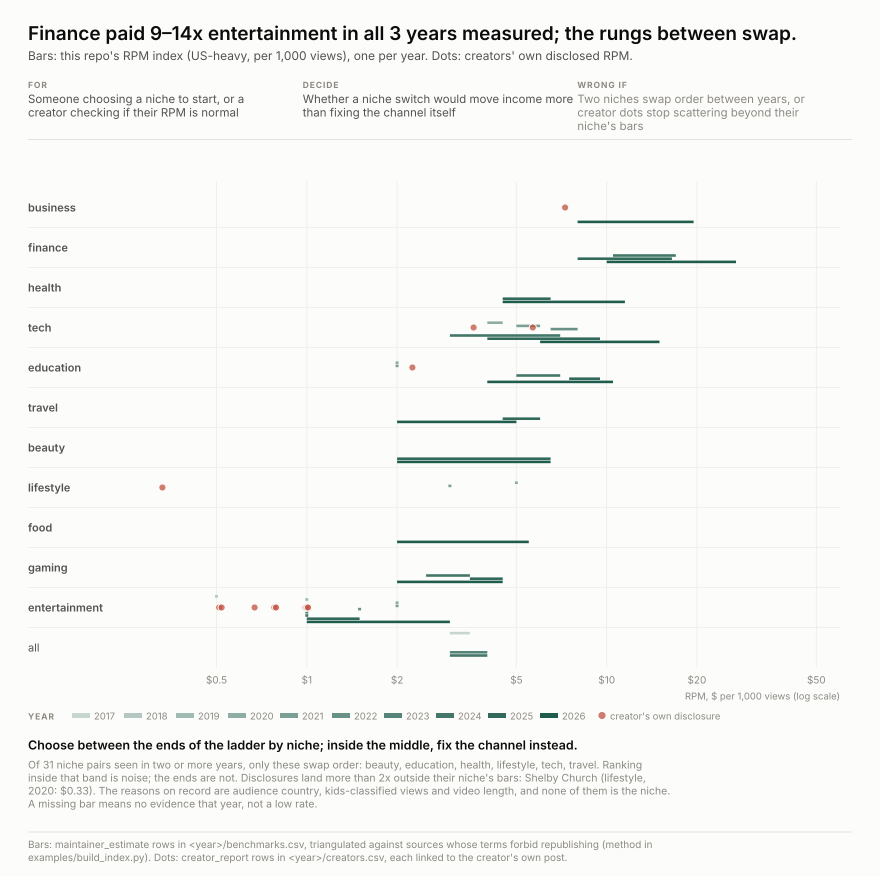
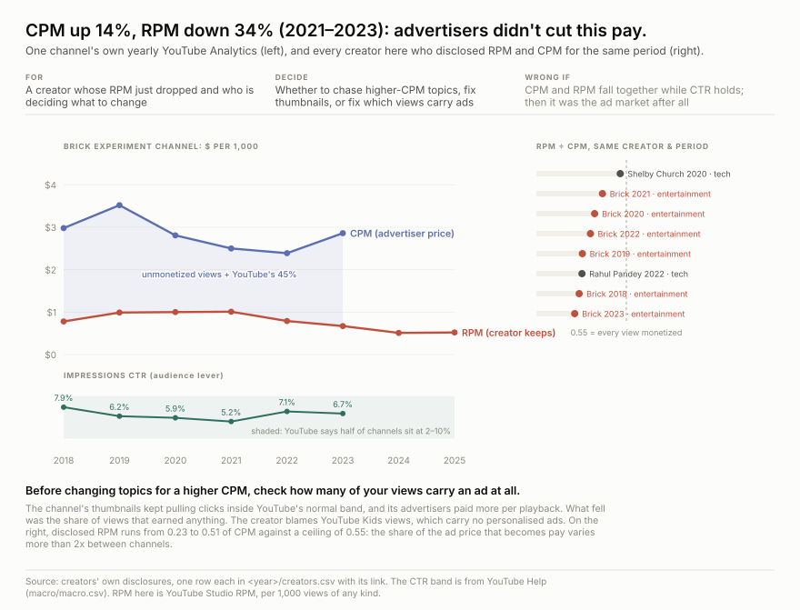
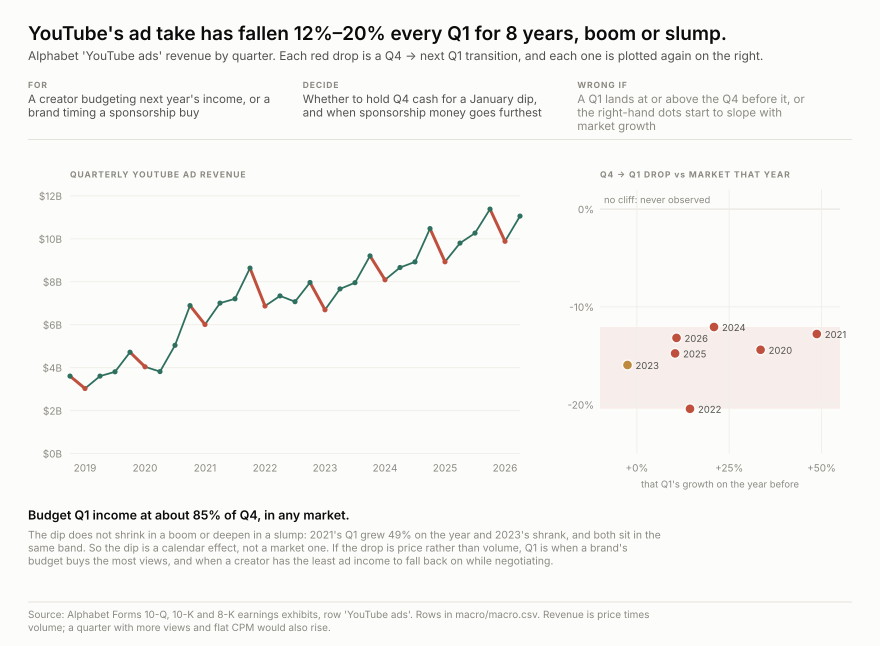
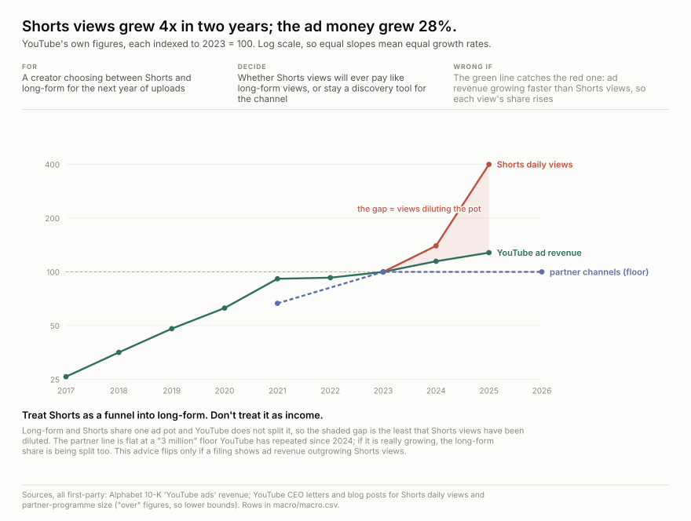

<h1 align="center">youtube-cpm</h1>

<p align="center">
  <strong>What YouTube pays per 1,000 views, by niche and by year: one row per claim, each with its source</strong>
</p>

<div align="center">

  <a href="https://github.com/q3dresearch/youtube-cpm/commits"></a>
  <a href="https://github.com/q3dresearch/youtube-cpm/blob/main/LICENSE-DATA"></a>
  <a href="https://github.com/q3dresearch/youtube-cpm"></a>

</div>

**This is a fact table, not the truth.** It records who said what about YouTube pay, and
when. It is updated by hand whenever someone publishes a new number worth keeping, usually a
creator posting their own YouTube Studio screenshot. Nothing here is scraped on a schedule.

<!-- tables:start -->
### RPM by niche, 2026

What a creator keeps per 1,000 views, mostly US audience. This is our own estimate; see [how it is made](#where-the-numbers-come-from).

| niche | RPM | evidence | creators' own reports, all years |
| --- | ---: | --- | ---: |
| **finance** | **$10 – $27** | 2 voters, same year | — |
| **business** | **$8 – $19.50** | 2 voters, same year | 1 |
| **tech** | **$6 – $15** | 2 voters, same year | 2 |
| **health** | **$4.50 – $11.50** | 2 voters, same year | — |
| **education** | **$4 – $10.50** | 2 voters, same year | 1 |
| **beauty** | **$2 – $6.50** | 2 voters, pooled 2025-2026 | — |
| **food** | **$2 – $5.50** | 2 voters, same year | — |
| **travel** | **$2 – $5** | 3 voters, pooled 2025-2026 | — |
| **gaming** | **$2 – $4.50** | 2 voters, same year | — |
| **entertainment** | **$1 – $3** | 2 voters, same year | 8 |

### The same index, every year

Midpoint of the range, $ per 1,000 views. **—** means there was no evidence we could use that year, not a low rate.

| niche | 2017 | 2018 | 2019 | 2020 | 2021 | 2022 | 2023 | 2024 | 2025 | 2026 |
| --- | ---: | ---: | ---: | ---: | ---: | ---: | ---: | ---: | ---: | ---: |
| finance | — | — | — | — | — | — | — | $13.75 | $12.25 | $18.50 |
| business | — | — | — | — | — | — | — | — | — | $13.75 |
| tech | — | — | — | $4.25 | $5.50 | $7.25 | — | $5 | $6.75 | $10.50 |
| health | — | — | — | — | — | — | — | — | $5.50 | $8 |
| education | — | — | — | $2 | $2 | — | — | $6 | $8.50 | $7.25 |
| beauty | — | — | — | — | — | — | — | — | $4.25 | $4.25 |
| food | — | — | — | — | — | — | — | — | — | $3.75 |
| travel | — | — | — | — | — | — | — | — | $5.25 | $3.50 |
| gaming | — | — | — | — | — | — | — | $3 | $4 | $3.25 |
| entertainment | — | $0.50 | $1 | $2 | $2 | $1.50 | $1 | $1 | $1.25 | $2 |
| all | $3.25 | — | — | — | — | — | $3.50 | $3.50 | — | — |
| lifestyle | — | — | — | $5 | $3 | — | — | — | — | — |

### The platform, from YouTube and Alphabet only

| year | YouTube ad revenue | Q1 vs the Q4 before | Shorts daily views | partner channels |
| ---: | ---: | ---: | ---: | ---: |
| 2017 | $8.2B |  |  |  |
| 2018 | $11.2B |  |  |  |
| 2019 | $15.1B | -16% |  |  |
| 2020 | $19.8B | -14% |  |  |
| 2021 | $28.8B | -13% |  | 2M+ |
| 2022 | $29.2B | -20% |  |  |
| 2023 | $31.5B | -16% | 50B+ |  |
| 2024 | $36.1B | -12% | 70B+ | 3M+ |
| 2025 | $40.4B | -15% | 200B+ |  |
| 2026 | — | -13% | 200B+ | 3M+ |

### Creators' own disclosures

39 rows from 9 creators, each linked to the creator's own post. Below is each creator's latest RPM; every row (CPM, CTR, Shorts, earlier years) is in `<year>/creators.csv`.

| year | creator | niche | metric | value | period | source |
| ---: | --- | --- | --- | ---: | --- | --- |
| 2025 | Brick Experiment Channel | entertainment | rpm | $0.52 | 2025 calendar year (long-form) | [link](https://brickexperimentchannel.wordpress.com/2026/01/02/year-2025-in-review/) |
| 2023 | Shelia Huggins | legal | rpm | $1.26 | first month after monetization (c. 2023-01) | [link](https://medium.com/over-legal/how-i-quadrupled-my-youtube-channel-rpm-in-1-month-571094d1e9bd) |
| 2023 | hahamrfunnyguy (HN) | diy | rpm | $3.52 | channel RPM as of 2023-01 | [link](https://news.ycombinator.com/item?id=34233224) |
| 2022 | Rahul Pandey | tech | rpm | $3.60 | 2022 calendar year | [link](https://www.indiehackers.com/post/i-made-9k-from-my-youtube-channel-in-2022-and-its-powering-my-company-904abffdbe) |
| 2021 | Linguamarina (Marina Mogilko) | education | rpm | $2 – $2.50 | monthly (c. early 2021) | [link](https://marinamogilko.substack.com/p/how-to-make-500k-a-month-on-youtube) |
| 2020 | Shelby Church | lifestyle | rpm | $0.33 | lifetime of one video to 2020-04 | [link](https://onezero.medium.com/this-is-how-much-youtube-paid-me-for-my-1-000-000-viewed-video-1453cad73847) |
| 2019 | Roberto Blake | business | rpm | $7.27 | 2019 full year | [link](https://robertoblake.com/youtube-income-reports-for-jan-nov-2019/) |

<!-- tables:end -->

## What the numbers say



**The niche matters at the ends of the ladder and hardly at all in the middle.** Finance
and business pay the most in every year they can be measured, and entertainment and gaming
the least. Between them, education, tech, health, travel, lifestyle and beauty swap places
from one year to the next. And one creator's own numbers can sit more than 10x from their
niche's range, for reasons that have nothing to do with the niche.



**A falling RPM is often not the advertisers.** Only one public channel has published its
own RPM, CPM and thumbnail click-through rate every year. Over 2021–2023 its advertisers
paid *more* per playback, while its click-through rate stayed within YouTube's normal range.
What fell was the share of its views that carried an ad at all. Across every creator here
who disclosed both RPM and CPM, the share of the ad price that reaches the creator ranges
from 0.23 to 0.51.



**Budget Q1 at about 85% of Q4.** Alphabet's own filings show YouTube's Q1 ad revenue below
the Q4 before it in all eight transitions from 2018 to 2025. The size of the drop does not
depend on whether the market was growing 49% or shrinking.



**The ad pot is being split across far more views.** From 2023 to 2025, YouTube's own
figures show Shorts daily views growing from 50 billion to 200 billion, while YouTube ad
revenue grew from $31.5B to $40.4B. Long-form and Shorts are paid from the same pot, so treat
Shorts as a funnel into long-form, not as income.

## Where the numbers come from

**A value appears here only if we are allowed to publish it.** Most RPM-by-niche tables online
sit behind terms that forbid redistribution, so this repository never names them or copies
their values. Every row has a `basis`:

| `basis` | what it is | cited to |
| --- | --- | --- |
| `maintainer_estimate` | **our own index.** A range per niche and year, set after reading sources we may not republish. Trust us or don't. | this repo; `locator` says how many sources it was checked against |
| `creator_report` | a creator showing their own YouTube Studio numbers in public | the creator's own post or video, never an article about it |
| `open_source` | a dataset whose licence allows redistribution | that dataset, under its licence |
| `platform_report` | YouTube's or Alphabet's own statements and filings | the filing or official post (`macro/`) |

**How the index is made:** [`examples/build_index.py`](examples/build_index.py) builds it
from the private sources:

1. It needs at least two independent voters for a niche and year.
2. All the verified creator reports together count as one extra vote.
3. A table reprinted unchanged in a later year counts only once.
4. RPM is never computed from CPM.
5. If a year has too little evidence, neighbouring years are borrowed, and `locator` says so.

The sources themselves live in a folder git ignores.

**RPM and CPM are not the same number:**

| | who it is for | counted per | what it includes |
| --- | --- | --- | --- |
| **CPM** | the advertiser | 1,000 ad impressions | gross price, before YouTube's cut |
| **RPM** | the creator | 1,000 views, with or without an ad | net pay after YouTube's 45%, including Premium, memberships and Super Chat |

## Add a data point

Saw a creator share their YouTube Studio numbers? Add a row to `<year>/creators.csv`:

1. Link to **the creator's own post or video**, not a news story about it. Put the timestamp
   in `locator` if it is a video.
2. Copy the number as shown. If you computed it (revenue ÷ views × 1000), start `notes` with
   `DERIVED`.
3. Run `python3 examples/load.py`, which rejects malformed rows, then
   `python3 examples/readme_tables.py` to refresh the tables above.

[QUEUE.md](QUEUE.md) lists disclosure videos that were found through media coverage but
whose numbers nobody has yet checked in the video itself.

## Has someone already built this?

As of September 2026, not quite:

- **[LensPOV, *YouTube CPM by Niche 2026*](https://www.kaggle.com/datasets/vincentcouey/youtube-cpm-by-niche-2026)**
  (CC-BY-4.0) is the closest. It has 30 niches, but it is a single 2026 snapshot of
  aggregates. Several of its sources are channel home pages rather than the post with the
  number, and its RPM column is 0.55 × CPM, not a measured RPM. We republish its CPM rows in
  [2026/benchmarks.csv](2026/benchmarks.csv) and leave out its RPM rows.
- **Studies from channel networks and SEO blogs** publish niche RPMs drawn from real
  channels. They release aggregates only, rewrite the page each year, and reserve all rights.
- **FYPM** crowdsources brand-deal rates, not AdSense, and is members-only.
- **GitHub, Hugging Face and Kaggle** hold RPM calculators and prediction toys, but no
  dated table sourced row by row.

What this adds: a row for each creator's own disclosure, history across years, and a
public diff every time a number changes.

## Layout

```
<year>/benchmarks.csv   niche rates for that year: our index, plus open-licence rows
<year>/creators.csv     creators' own disclosures, one row per metric per period
macro/macro.csv         YouTube / Alphabet first-party series (revenue, Shorts, partner count, CTR norms)
examples/               loader, index builder, the four charts, README table generator
QUEUE.md                disclosures found but not yet verified
```

## Licence

Code: MIT ([LICENSE](LICENSE)). Our index, notes and charts: CC-BY-4.0. Every other value
belongs to whoever published it. See [LICENSE-DATA](LICENSE-DATA) before quoting a number.
